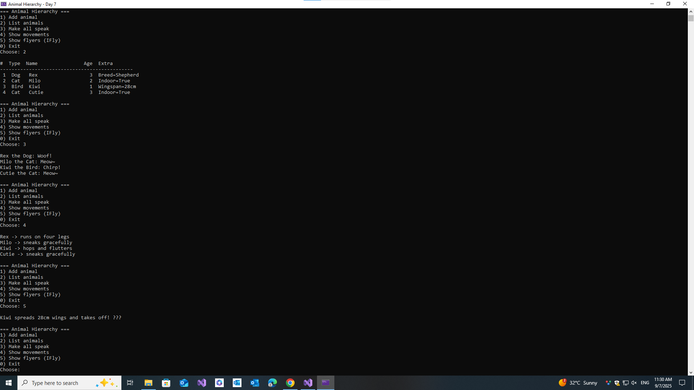

# 🐾 Animal Hierarchy (C# Console App)

**Day 7** of my 30-Day C# plan — demonstrates **Inheritance, Polymorphism, and Interfaces** with a simple animal model.

## Features
- `Animal` abstract class with `Speak()` and `Move()`
- `Dog`, `Cat`, `Bird` subclasses with overrides
- `IFly` interface implemented by `Bird`
- Polymorphic actions on `List<Animal>`
- Console menu with validation & colored output

---

## 📸 Screenshots

| 🐾 |
|-----|
|  |
